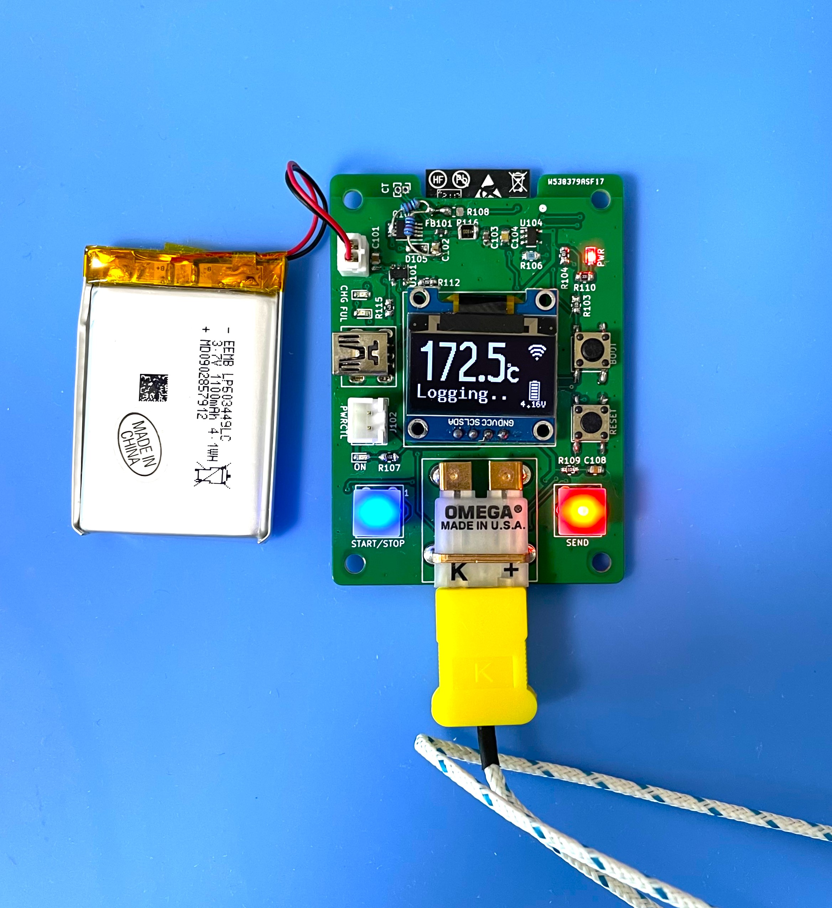
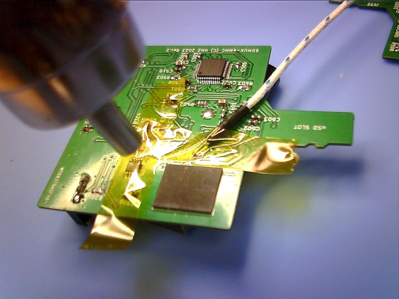
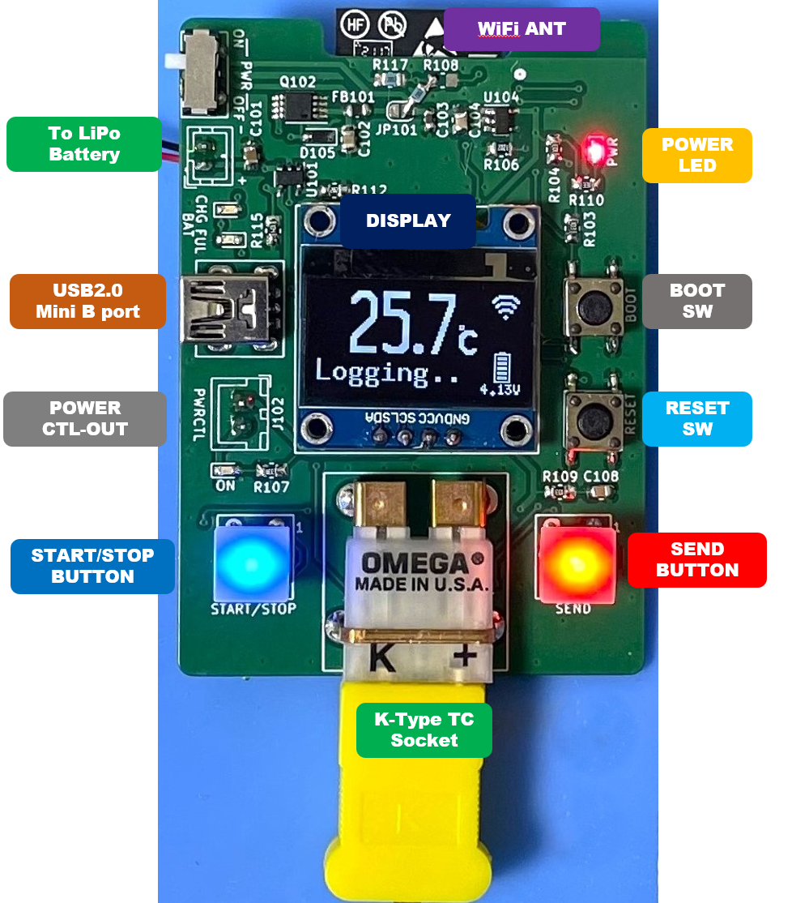
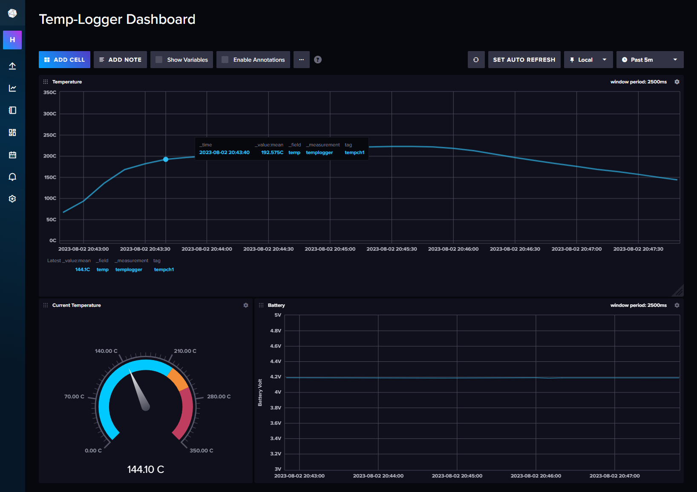

<div align="center">
  <h1><code>Temperature Logger for K-Type Thermocouple</code></h1>
  <p>
    
  </p>
</div>

# TempLogger - Temperature Logger for K-Type Thermocouple

This board provides a logging function that gets data on temperature from a K-type thermocouple.

# Feature

**Microcontroller on board** - No need for a PC when you are measuring a temperature.

**Transfer Temperature data via WiFi** - This Logger can transfer temperature data to Linux PC via WiFi network and you can see the dashboard graph in influxDB.

**Battery Powered** - Using LiPo battery. It can run for 48 hours.

# How to use the TempLogger
Put on the thermocouple where you want to measure the temperature.  



Push the START/STOP button, then TempLogger starts to log the temperature. And if you want to send data on temperature, push the SEND button. During the measurement, TempLogger can send the data to a PC. 




A display can show you the current temperature, battery voltage, and WiFi connection status.

If WiFi could not connect to WiFi Access Point, the WiFi mark won't be shown on the display.

You can see the realtime data using Dashboard by [InfluxDB](https://www.influxdata.com/influxdb/).



After the measure, to stop logging, push the START/STOP button again.

To charge a battery, just connect to a USB mini-B port from the bus-powered USB port. During the charge, the CHG LED is RED ON. After the charging is full, the FUL LED is GREEN ON. And the charging will be stopped automatically. But, 

DO NOT CONTINUE THE CHARGE IF THE BATTERY IS FULL FOR A LONG TIME. 

# How to build code

Using Ubuntu 22.04.02 LTS

1. Install Rust Compiler
```bash
$ sudo apt -y install git python3 python3-pip gcc build-essential curl pkg-config libudev-dev libtinfo5 clang libclang-dev llvm-dev udev
$ curl --proto '=https' --tlsv1.2 -sSf https://sh.rustup.rs | sh
select No.1
$ source "$HOME/.cargo/env"
```

2. Install toolchain for ESP32-C3
```bash
$ cargo install ldproxy
$ cargo install espup
$ rustup toolchain install nightly --component rust-src
$ rustup target add riscv32imc-unknown-none-elf
$ cargo install cargo-espflash
```

3. Add UDEV rules
```bash
$ sudo sh -c 'echo "SUBSYSTEMS==\"usb\", ATTRS{idVendor}==\"303a\", ATTRS{idProduct}==\"1001\", MODE=\"0666\"" > /etc/udev/rules.d/99-esp32.rules'
$ sudo udevadm control --reload-rules
$ sudo udevadm trigger
```

4. Download Temp-Logger code
```bash
$ git clone https://github.com/hnz1102/temp-logger.git
$ cd temp-logger/src/temp-logger
``` 
5. Setting WiFi SSID, Password, and InfluxDB server IP address.
```bash
src\temp-logger\cfg.toml

[templogger]
wifi_ssid = "<your-AP-ssid>"     # Set your AP ssid.
wifi_psk = "<your-AP-Password>"  # Set password for ssid
http_server = "<PC address>:3000" # Set IP address and port. port should be 3000.
```

6. Connecting the board and Set device and set toolchain.
```bash
Connecting the Temp-Logger by USB to this build code PC. Then, 
$ cargo espflash board-info
select /dev/ttyACM0
Chip type:         esp32c3 (revision v0.4)
Crystal frequency: 40MHz
Flash size:        4MB
Features:          WiFi, BLE
MAC address:       xx:xx:xx:xx:xx:xx

$ rustup component add rust-src --toolchain nightly-2023-06-10-x86_64-unknown-linux-gnu
```

7. Build code and writing flash
```bash
$ cargo espflash flash --release --monitor
App/part. size:    950,864/3,145,728 bytes, 30.23%
[00:00:00] [========================================]      12/12      0x0                                                                       
[00:00:00] [========================================]       1/1       0x8000                                                                    
[00:00:11] [========================================]     535/535     0x10000                                                                   [2023-08-03T13:05:12Z INFO ] Flashing has completed!

And automaticaly boot!
```

# How to Install the influxDB and Agent

1. Download [influxDB](https://docs.influxdata.com/influxdb/v2.7/install/?t=Linux) and Install.
```bash
$ wget https://dl.influxdata.com/influxdb/releases/influxdb2-2.7.0-amd64.deb
$ sudo dpkg -i influxdb2-2.7.0-amd64.deb
$ sudo service influxdb start
```

2. Configure the influxDB

```
Connect to the 'http://<influxDB installed PC Address>:8086'
```
Click `GET STARTED` and set `Username`, `Password`, `Initial Organization Name`, and `Initial Bucket Name`
|Term|Value|
|---|---|
|Username|Set login username as influxDB administrator web console|
|Password|Set login password as influxDB administrator web console|
|Initial Organization Name| Organization Name ex. ORG|
|Initail Bucket Name| LOGGER |

After set them, click `CONTINUE`.

3. Copy the operator API token.

You can see the operator API token on the browser. YOU WON'T BE ABLE TO SEE IT AGAIN!

After copy the token, click `CONFIGURE LATER`.

4. Import the Dashboard Template.

Click the `Dashboard` icon, and select `Import Dashboard` from the `CREATE DASHBOARD` menu.

Drop the `src/server/temp-logger_dashboard.json` file to `Drop a file here`, then click `IMPORT JSON AS DASHBOARD`.

You can see the `Temp-Logger Dashboard` pannel on the Dashboards page.

Click this panel, and You can see the Temp-Logger Dashboard.

If you want to customize the dashboard design, click configure mark. You can change the graph design.

5. Install the Agent.

Temp-Logger can't directly send data to influxDB API since ESP32-C3 has not TSL software stack. This agent program is responsible for changing HTTP communication from Temp-Logger to HTTPS communication and passing data to the InfluxDB API. This agent is purpose only for a local network because it has no security.

Before install you have to change parameters in main.js.

src/server/main.js
```javascript
const token = "<influxDB API Access Token>"
const url = 'http://<influxDB installed IP address>:8086'
let org = `<YOUR ORGANIZATION NAME: it has to be same the Initial Organization Name>`
let bucket = `LOGGER`
```

Install the agent program.

```bash
$ cd src/server/
$ ./install.sh
```
If it is `Active: active`` as shown below, it has started normally.
```
● influxdb-agent.service - InfluxDB Agent
     Loaded: loaded (/lib/systemd/system/influxdb-agent.service; enabled; vendor preset: enabled)
     Active: active (running) since Sat 2023-08-05 02:24:18 UTC; 15ms ago
```

6. Start Temp-Logger Logging and Send Data.

Push the START/STOP button, and push SEND button. Logging data will be sent to the influxDB. You can see the data on the dashboard.

# Add Battery Monitor

A small modification was made to monitor the battery voltage.

I already fixed new PCB gerber data.

## LICENSE
This source code is licensed under MIT. Other Hardware Schematic documents are licensed under CC-BY-SA V4.0.
