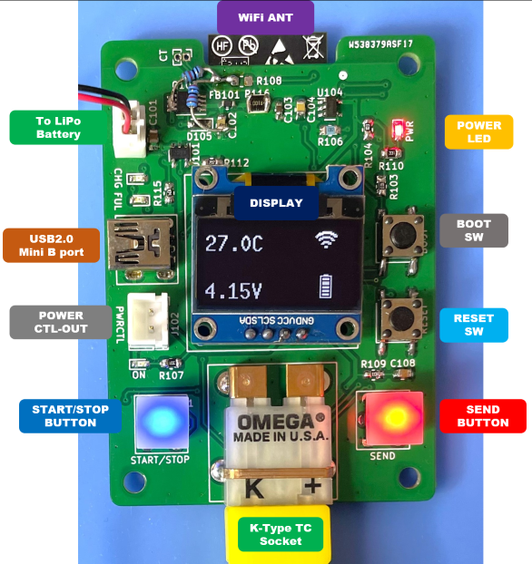

<div align="center">
  <h1><code>Temperature Logger for K-Type Thermocouple</code></h1>
  <p>
    
  </p>
</div>

# TempLogger - Temperature Logger for K-Type Thermocouple

This board provides a logging function that gets data on temperature from a K-type thermocouple.

# Feature

**Microcontroller on board** - No need for a PC when you are measuring a temperature.

**Transfer Temperature data via WiFi** - This Logger can transfer temperature data to Linux PC via WiFi network and you can see the dashboard graph in influxDB.

**Battery Powered** - Using LiPo battery. It can run for 48 hours.

# How to use the TempLogger
Put on the thermocouple where you want to measure the temperature.  


Push the START/STOP button, then TempLogger starts to log the temperature. And if you want to send data on temperature, push the SEND button. During the measurement, TempLogger can send the data to a PC. 




A display can show you the current temperature, battery voltage, and WiFi connection status.

If WiFi could not connect to WiFi Access Point, the WiFi mark won't be shown on the display.

You can see the realtime data using Dashboard by [InfluxDB](https://www.influxdata.com/influxdb/).


After the measure, to stop logging, push the START/STOP button again.

To charge a battery, just connect to a USB mini-B port from the bus-powered USB port. During the charge, the CHG LED is RED ON. After the charging is full, the FUL LED is GREEN ON. And the charging will be stopped automatically. But, 

DO NOT CONTINUE THE CHARGE IF THE BATTERY IS FULL FOR A LONG TIME. 

# How to build code

Using Ubuntu 22.04.02 LTS

1. Install Rust Compiler
```bash
$ sudo apt -y install git python3 python3-pip gcc build-essential curl pkg-config libudev-dev libtinfo5 clang libclang-dev llvm-dev udev
$ curl --proto '=https' --tlsv1.2 -sSf https://sh.rustup.rs | sh
select No.1
$ source "$HOME/.cargo/env"
```

2. Install toolchain for ESP32-C3
```bash
$ cargo install ldproxy
$ cargo install espup
$ rustup toolchain install nightly --component rust-src
$ rustup target add riscv32imc-unknown-none-elf
$ cargo install cargo-espflash
$ rustup component add rust-src --toolchain nightly-2023-06-10-x86_64-unknown-linux-gnu
```

3. Add UDEV rules
```bash
$ sudo sh -c 'echo "SUBSYSTEMS==\"usb\", ATTRS{idVendor}==\"303a\", ATTRS{idProduct}==\"1001\", MODE=\"0666\"" > /etc/udev/rules.d/99-esp32.rules'
$ sudo udevadm control --reload-rules
$ sudo udevadm trigger
```

4. Download Temp-Logger code
```bash
$ git clone https://github.com/hnz1102/temp-logger.git
$ cd temp-logger/src/temp-logger
``` 
5. Setting WiFi SSID, Password, and InfluxDB server IP address.
```bash
src\temp-logger\cfg.toml

[templogger]
wifi_ssid = "<your-AP-ssid>"     # Set your AP ssid.
wifi_psk = "<your-AP-Password>"  # Set password for ssid
http_server = "<PC address>:3000" # Set IP address and port. port should be 3000.
```

6. Connecting the board and Set device.
```bash
Connecting the Temp-Logger by USB to this build code PC. Then, 
$ cargo espflash board-info
select /dev/ttyACM0
Chip type:         esp32c3 (revision v0.4)
Crystal frequency: 40MHz
Flash size:        4MB
Features:          WiFi, BLE
MAC address:       xx:xx:xx:xx:xx:xx
```

7. Build code and writing flash
```bash
$ cargo espflash flash --release --monitor
App/part. size:    950,864/3,145,728 bytes, 30.23%
[00:00:00] [========================================]      12/12      0x0                                                                       
[00:00:00] [========================================]       1/1       0x8000                                                                    
[00:00:11] [========================================]     535/535     0x10000                                                                   [2023-08-03T13:05:12Z INFO ] Flashing has completed!

And automaticaly boot!
```

## LICENSE
This Software is licensed under MIT. Other Hardware Schematic documents are licensed under CC-BY-SA V4.0.
