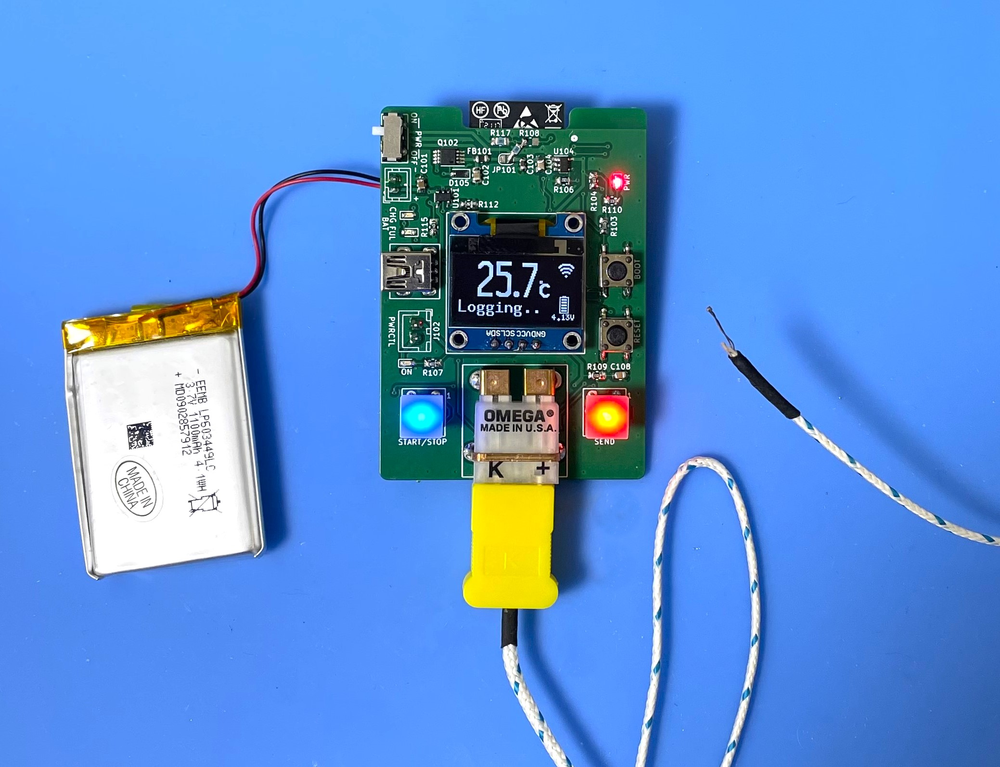

  <h1><code>Temperature Logger for K-Type Thermocouple</code></h1>
  

    
  

# TempLogger - Temperature Logger for K-Type Thermocouple

This board provides a logging function that gets data on temperature from a K-type thermocouple.

# Feature

**Microcontroller on board** - No need for a PC when you are measuring a temperature.

**Transfer Temperature data via WiFi** - This Logger can transfer temperature data to Linux PC via WiFi network and you can see the dashboard graph in influxDB.

**Battery Powered** - Using LiPo battery. It can run for 48 hours.

# How to use the TempLogger
Put on the thermocouple where you want to measure the temperature.  

Push the START/STOP button, then TempLogger starts to log the temperature. And if you want to send data on temperature, push the SEND button. During the measurement, TempLogger can send the data to a PC. 

A display can show you the current temperature, battery voltage, and WiFi connection status.

If WiFi could not connect to WiFi Access Point, the WiFi mark won't be shown on the display.

You can see the realtime data using Dashboard by [InfluxDB](https://www.influxdata.com/influxdb/).

After the measure, to stop logging, push the START/STOP button again.

To charge a battery, just connect to a USB mini-B port from the bus-powered USB port. During the charge, the CHG LED is RED ON. After the charging is full, the FUL LED is GREEN ON. And the charging will be stopped automatically. But, 

DO NOT CONTINUE THE CHARGE IF THE BATTERY IS FULL FOR A LONG TIME. 

## LICENSE
This Software is licensed under MIT. Other Hardware Schematic documents are licensed under CC-BY-SA V4.0.
